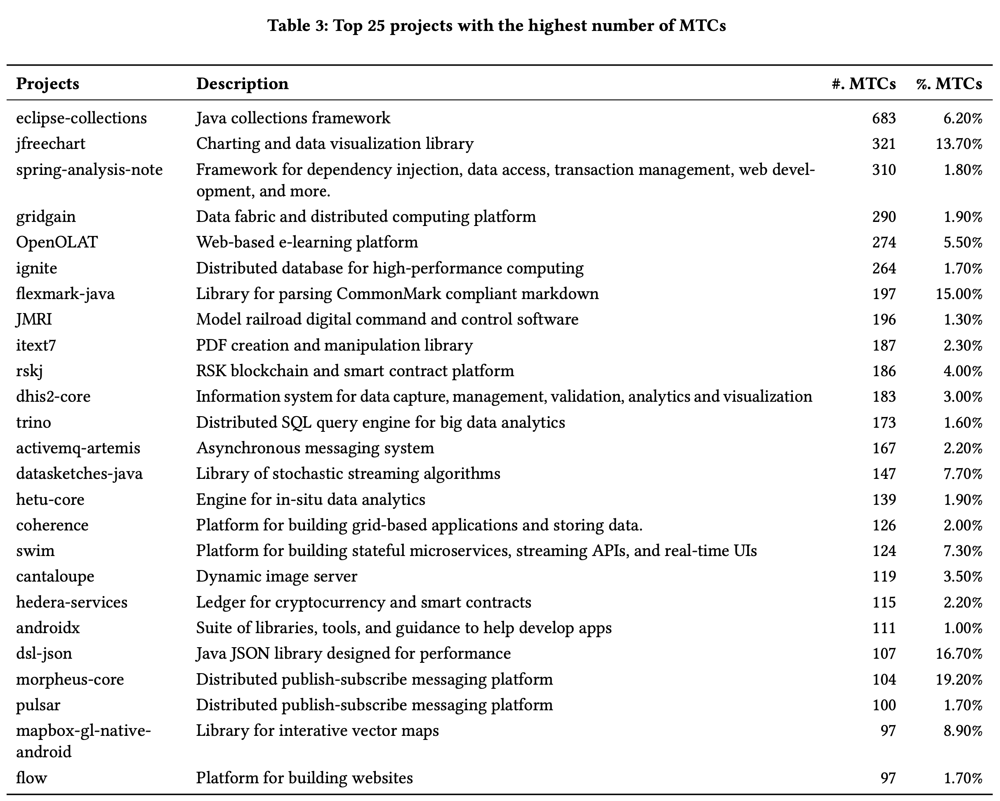

<!-- ---
title: MR-SCOUT: Automated Synthesis of Metamorphic Relations from Existing Test Cases
--- -->

## Welcome to MR-Scout's Site！
----
The paper "[MR-SCOUT: Automated Synthesis of Metamorphic Relations from Existing Test Cases](https://github.com/MR-Scout/MR-Scout.github.io/blob/main/TOSEM-2023-0286.pdf)" is submitted to TOSEM. This page offers access to MR-Scout and experimental data. Additionally, it provides the supplementary materials, including the analysis of MTC-rich project domains and Evosuite configuration.


**Table of Contents**
- [MR-Scout](#MR-Scout)
- [Experimental Data](#experimental-data)
	+ MTC Dataset
    + RQ1: Soundness
	+ RQ2: Quality
	+ RQ3: Usefulness
    + RQ4: Comprehensibility
- [Supplementary Materials](#supplementary-materials)
	+ Domain analysis 
	+ Evosuite Configuration


## MR-Scout
---
Metamorphic Testing (MT) alleviates the oracle problem by defining oracles based on metamorphic relations (MRs), that govern multiple related inputs and their outputs. However, designing MRs is challenging, as it requires domain-specific knowledge. This hinders the widespread adoption of MT. We observe that developer-written test cases can embed domain knowledge that encodes MRs. Such encoded MRs could be synthesized for testing not only their original programs but also other programs that share similar functions. 

In this paper, we propose MR-Scout to automatically synthesize MRs from test cases in open-source software (OSS) projects. MR-Scout first discovers MR-encoded test cases (MTCs), and then synthesizes the encoded MRs into parameterized methods (called codified MR), and filters out MRs that demonstrate low quality for new test case construction. MR-Scout discovered over 11,000 MTCs from 701 OSS projects. Experimental results show that over 97% of MR-Scout codified MRs are of high quality for new test case construction, demonstrating the practical applicability of MR-Scout. Furthermore, test cases constructed from the codified MRs can effectively improve test coverage, leading to 13.52% and 9.42% increases in line coverage and mutation score, when compared to developer-written test suites. 
Our qualitative study shows that 55.76% to 75.00% of codified MRs can be easily comprehended. 

The source code, executable package and tutorial of MR-Scout can be found [here](https://github.com/MR-Scout/MR-Scout.github.io/blob/main/tool). 


## Experimental Data
---
**MTC Dataset.** 
MR-Scout discovered a total of 11,350 MTCs from across OSS projects. Identified MTCs can be found [here](https://github.com/MR-Scout/MR-Scout.github.io/blob/main/experimentalData/MTC_Dataset.json). (NOTE: The experimental projects were collected on April 5th, 2022. Due to the continuous evolution of these projects, provided signatures and paths of MTCs may be outdated. If you encounter any outdated cases, please report the issue to us. Your contributions are greatly appreciated! 😄)


**RQ1: Soundness.** 
To evaluate the soundness of MR-Scout in discovering MTCs, we manually examined 164 samples, and found 97% of them are true positives. This indicates the high precision of MR-Scout in discovering MTCs and the high quality of our MTC dataset

The true positives can be found [here](https://github.com/MR-Scout/MR-Scout.github.io/blob/main/experimentalData/RQ1-soundnessTPs.java). \
The false positives can be found [here](https://github.com/MR-Scout/MR-Scout.github.io/blob/main/experimentalData/RQ1-soundnessFPs.java). 


**RQ2: Quality.** 
MR-Scout synthesizes codified MRs from MTCs and applies filtering to remove low-quality MRs. To evaluate the effectiveness of this process, we prepared a set of new test inputs for each codified MR. Experimental results show that 97.18% of MR-Scout synthesized MRs are of high quality and applicability to new inputs for automated test case generation, demonstrating the practical applicability of MR-Scout.

The detailed experimental data can be found [here](https://github.com/MR-Scout/MR-Scout.github.io/blob/main/experimentalData/RQ2-quality.xlsx). 

**RQ3: Usefulness.** 
To demonstrate the usefulness of synthesized MRs in enhancing test adequacy, we compared test suites constructed from MR-Scout codified MRs against developer-written and EvoSuite-generated test suites. We employ four metrics: line coverage, mutation score, percentage of covered mutants, and test strength.

We successfully ran PIT to generate 2,170 mutants for 51 target classes from 75 reusable codified MRs (totally 4,701 lines of code in target classes).

The detailed experimental data can be found [here](https://github.com/MR-Scout/MR-Scout.github.io/blob/main/experimentalData/RQ3-usefulnessData.xlsx). 


**RQ4: Comprehensibility.** 
To evaluate the comprehensibility of codified MRs, we conducted a qualitative study involving three participants and 52 samples. Results show that 55.76% to 75.00% of codified MRs are easily comprehended, showcasing their potential for practical adoption by developers.

The detailed studied codified MRs can be found [here](https://github.com/MR-Scout/MR-Scout.github.io/blob/main/experimentalData/RQ4-comprehensibility/qualitativeStudy-codifiedMRs/). 


## Supplementary Materials
---
<!-- These materials are omitted from the submitted paper due to space limitations, and the PDF document can be found. -->

**Domain analysis.** 


We examined the top 25 projects with the highest number of MTCs (the list of projects can be found in above image). These projects span various domains, including complex data structures, data processing, distributed computing, data visualization, smart contracts, website building, code parsing, and more.
The results indicate that MTCs are broadly distributed across projects from diverse domains rather than being concentrated within a few projects with specific functionalities.


**Evosuite Configuration.** 
We set the following flags while retaining the default values for other flags which can be found [here](https://github.com/MR-Scout/MR-Scout.github.io/blob/main/experimentalData/EvosuiteParameters.xlsx). 

``` java
-seed hash(str(i_execution)) // i_execution: number of execution, i.e., 1,2,3 ....., 100 
-Dnull_probability=0.1 
-Dcatch_undeclared_exceptions=false
-Dminimize=false 
-Dcheck_contracts=true
-Dcriterion=LINE:BRANCH
-Dalgorithm=RANDOM_SEARCH 
-Dassertions=false
```


<!-- ### Automated Discovery of Metamorphic Relations from Existing Test Cases -->

<!--
**MR-Scout/MR-Scout** is a ✨ _special_ ✨ repository because its `README.md` (this file) appears on your GitHub profile.

Here are some ideas to get you started:

- 🔭 I’m currently working on ...
- 🌱 I’m currently learning ...
- 👯 I’m looking to collaborate on ...
- 🤔 I’m looking for help with ...
- 💬 Ask me about ...
- 📫 How to reach me: ...
- 😄 Pronouns: ...
- ⚡ Fun fact: ...
-->
